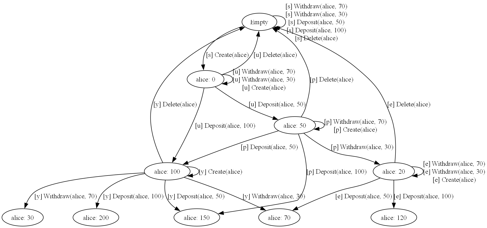

<!-- Keep in sync with docs/index.md (adjust paths: docs/X -> X, Samples/ -> ../Samples/) -->


**Executable behavioral specifications for .NET**

[Documentation](https://microsoft.github.io/accordant) · [NuGet](https://nuget.org/packages/Microsoft.Accordant) · [Samples](Samples/)

Accordant is a framework for model-based testing. You describe what your system should do, and Accordant tells you if the implementation actually does it.

You write a *spec* — executable code that captures the rules of your system. Given any state and any operation, the spec predicts what the response should be. Call the real system, check the response against the spec, and you know whether the observed behavior is correct or buggy. The spec is your oracle: a single source of truth about what "correct" means.

---

## How You Test Today

Say you're building a banking service — accounts, deposits, withdrawals. You write tests like these:

```csharp
[Test]
public async Task Withdraw_WithSufficientBalance_Succeeds()
{
    await client.CreateAccount("alice");
    await client.Deposit("alice", 100);
    
    var result = await client.Withdraw("alice", 30);
    
    Assert.True(result.IsSuccess);
    Assert.Equal(70, result.Data);
}

[Test]
public async Task Withdraw_FromNonexistentAccount_ReturnsNotFound()
{
    var result = await client.Withdraw("bob", 50);
    
    Assert.True(result.IsNotFound);
}
```

This is the standard pattern. Each test tells a story: set up state, call a method, check the result.

These are just two tests. You could write many more — deposits followed by withdrawals, operations on deleted accounts, the same account created twice. Different orderings, edge cases compounding. The space of possible sequences is large.

What if you could validate *arbitrary* operation sequences automatically?

Now notice something else. Look at those assertions — not the setup, the assertions.

The first test asserts: withdraw with sufficient balance should succeed and return the new balance. The second: nonexistent account returns not found.

These are pieces of the same *contract* — the rules for how Withdraw behaves. Even if you wrote dozens more tests by hand, you'd repeat these same rules through assertions, scattered across your test suite.

---

## Extract the Contract

What if you wrote those rules once, in one place?

Here's what that looks like:

```csharp
spec.Operation<WithdrawRequest, WithdrawResponse>("Withdraw", (request, state) =>
{
    if (!state.Accounts.TryGetValue(request.AccountId, out var balance))
        return Expect.That(r => r.IsNotFound).SameState();

    if (balance < request.Amount)
        return Expect.That(r => r.IsBadRequest).SameState();

    var newBalance = balance - request.Amount;
    return Expect.That(r => r.IsSuccess && r.Balance == newBalance)
                 .ThenState<BankState>(s => s.Accounts[request.AccountId] = newBalance);
});
```

`spec.Operation<TRequest, TResponse>` registers an operation with the spec. The two generic parameters are the request type (`WithdrawRequest` — what the caller sends) and the response type (`WithdrawResponse` — what the system returns). The lambda receives the request and current state, and returns the *expected* outcome: a predicate on the response using `Expect.That(...)`, paired with the expected state transition — either `.SameState()` if the state doesn't change, or `.ThenState(...)` to describe how the state should update.

But what's the state? In a stateful system, you can't predict the response from the request alone. Call Withdraw with the same request twice — the first might succeed, the second might fail because the balance changed. You need to know what the system is tracking.

For banking, that's just accounts and their balances:

```csharp
[State]
public partial class BankState
{
    public Dictionary<string, decimal> Accounts { get; set; } = new();
}
```

The state captures the minimal structure needed to say what correct behavior means. Nothing more complex is required. We treat the system as a black box — we don't need to know whether data is stored in a database, files, a cache, or anything else.

The spec doesn't query databases, route HTTP requests, or handle retries. It just encodes the semantics — what should happen, not how it's implemented.

→ [See the full BankAccount spec](Samples/BankAccount/)

---

## What This Unlocks

Once you have a spec — the semantics of your system encoded as executable code — a few things become possible.

### Automatic Test Generation

The spec can validate *any* response — so you don't have to write every test by hand. Hook up a fuzzer, generate random sequences, and the spec checks each response.

Accordant does something more systematic. You provide sample inputs — a few account IDs, some amounts — and Accordant explores systematically.

`spec.GetOperation<TRequest, TResponse>(name)` retrieves a typed operation handle by name — the generic parameters must match the request and response types used when registering it with `spec.Operation`. The `.With(request, label)` method pairs that operation with a specific request value, creating a labeled input for the test generator:

```csharp
var inputs = new InputSet
{
    spec.GetOperation<CreateAccountRequest, CreateAccountResponse>("CreateAccount")
        .With(new CreateAccountRequest("alice"), "Create(alice)"),
    spec.GetOperation<DepositRequest, DepositResponse>("Deposit")
        .With(new DepositRequest("alice", 50m), "Deposit(alice, 50)"),
    spec.GetOperation<DepositRequest, DepositResponse>("Deposit")
        .With(new DepositRequest("alice", 100m), "Deposit(alice, 100)"),
    spec.GetOperation<WithdrawRequest, WithdrawResponse>("Withdraw")
        .With(new WithdrawRequest("alice", 30m), "Withdraw(alice, 30)"),
    spec.GetOperation<WithdrawRequest, WithdrawResponse>("Withdraw")
        .With(new WithdrawRequest("alice", 70m), "Withdraw(alice, 70)"),
    spec.GetOperation<DeleteAccountRequest, DeleteAccountResponse>("DeleteAccount")
        .With(new DeleteAccountRequest("alice"), "Delete(alice)"),
};

var testCases = TestCaseGenerator.GenerateSequentialTestCases(
    context,
    initialState: new BankState(),
    inputs,
    new TestGenerationOptions { MaxDepth = 5 });
```

Because the spec defines what each operation does to state, Accordant can *simulate* the system — predicting what happens without running real code. Starting from an empty state, it tries every operation with every input. Operations that change the state produce new nodes (e.g., creating an account that doesn't exist); operations that don't change state loop back to the same node (e.g., depositing into a nonexistent account, or a read-only query). From each new node, it tries every operation again. The reachable states naturally unfold, and the graph captures how operations drive the system into deeper, more interesting states.



*The `[s]`, `[u]`, `[p]` prefixes are unique identifiers assigned to each operation call — they let generated test cases reference specific calls in the graph. Self-loop edges represent operations that don't change the state (e.g., withdrawing from a nonexistent account).*

Accordant then picks paths through this graph as test sequences:

1. `Create(alice)` → `Deposit(alice, 100)` → `Withdraw(alice, 30)` → `Withdraw(alice, 70)` ✓ balance now 0
2. `Create(alice)` → `Deposit(alice, 50)` → `Withdraw(alice, 70)` ✗ insufficient funds
3. `Create(alice)` → `Deposit(alice, 50)` → `Delete(alice)` → `Withdraw(alice, 30)` ✗ account not found

These aren't random — they're systematic walks designed to exercise different branches. Each sequence is then run against the real system, and the spec validates every response — checking that the real implementation matches the model.

```
Generated 31 test cases
Executed against BankAccount API
Results: 31 passed, 0 failed
```

This is the **spec as oracle**: for any sequence of operations — ones you thought of, ones you didn't — the spec knows what correct behavior looks like. No hand-coded assertions per scenario. This also improves your example-based tests: even when you hand-craft a specific sequence for a key scenario, the spec validates the responses. Hand-specified or mechanically generated, same oracle.

→ [How Test Generation Works](docs/concepts/how-test-generation-works.md)

### And More

The same spec enables other kinds of testing:

- **Concurrency testing** — Run operations in parallel, check that results are *linearizable* (explainable by some sequential ordering). Catches race conditions, double bookings, lost updates. → [Testing Race Conditions](docs/tutorials/05-testing-race-conditions.md)

- **Indefinite failures** — A socket timeout is ambiguous: maybe the request never reached the server, or maybe it did but you never heard the response. Specs can encode this non-determinism — the operation either happened or didn't. Combined with deterministic simulation (injecting controlled failures), you can test retry logic, idempotency, and recovery paths. → [Modeling Indefinite Failures](docs/how-to/indefinite-failures.md)

- **Async workflows** — Model multi-step processes, background jobs, polling for completion. The spec tracks pending work and expected completions. → [Step Functions & Async](docs/concepts/step-functions-and-async.md)

## Spec-Driven Development

The spec becomes the source of truth for how your system should behave.

**Reviewable and self-documenting** — Business rules live in one place: 60 lines of clear logic, not 600 lines of scattered assertions. A product manager can read the spec and say "yes, that's what we want." And unlike markdown docs, the spec is always up to date — if it doesn't match reality, tests fail.

**Confidence through change** — Refactor the implementation freely. When requirements change, update the spec and test generation adapts automatically. No hunting through test files to find every assumption that needs updating.

**AI-assisted development** — This pairs exceptionally well with AI coding assistants. You write the spec — the contract, the thing that matters. AI implements the mechanics: database layer, HTTP endpoints, retry policies, logging. The spec validates the result. You review 60 lines of spec logic, not 2000 lines of generated code. Run the tests — if the spec accepts every response, the implementation is correct.

---

## Get Started

Install the package ([NuGet](https://nuget.org/packages/Microsoft.Accordant)):

```bash
dotnet add package Microsoft.Accordant
```

### Learning Paths

**Just want to see it work?**
Clone the repo and run the BankAccount sample — 31 generated tests against a real ASP.NET Core API:
```bash
git clone https://github.com/microsoft/accordant.git
cd accordant/Samples/BankAccount/BankAccount.Api.Tests
dotnet test
```

**Building your first spec?**
- [Your First Spec](docs/tutorials/01-your-first-spec.md) — Define state, operations, and expectations
- [Handling Errors](docs/tutorials/02-handling-errors.md) — Model error conditions
- [Response-Dependent State](docs/tutorials/03-response-dependent-state.md) — When state depends on responses
- [Visualizing State Space](docs/tutorials/04-visualizing-state-space.md) — See the state graph and generated tests

**Going deeper?**
- [Concurrency Testing](docs/tutorials/05-testing-race-conditions.md) — Find race conditions with linearizability checking
- [Async Workflows](docs/tutorials/06-async-operations-polling.md) — Model background jobs and polling

### Documentation

| Type | What it covers |
|------|----------------|
| **[Tutorials](docs/tutorials/index.md)** | Step-by-step guides to learn Accordant |
| **[Concepts](docs/concepts/index.md)** | Understand the theory — model-based testing, linearizability, state graphs |
| **[How-To Guides](docs/how-to/index.md)** | Solve specific problems — "how do I reset state between tests?" |
| **[Samples](Samples/)** | Working code — BankAccount, TodoList, and more |
| **[API Reference](api/)** | Complete API documentation |

---

## Community

Have questions, ideas, or want to share what you're building? Join the conversation on [GitHub Discussions](https://github.com/microsoft/accordant/discussions).

---

## Contributing

See [CONTRIBUTING.md](CONTRIBUTING.md) for build instructions and contribution guidelines.

This project has adopted the [Microsoft Open Source Code of Conduct](https://opensource.microsoft.com/codeofconduct/).

## License

[MIT](LICENSE)