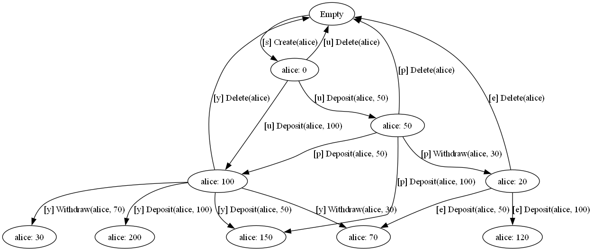

# How Test Generation Works

> **TL;DR**: Accordant explores the state graph defined by your spec and inputs, then extracts paths through that graph as test cases. The algorithm is pluggable — you can use state coverage, transition coverage, random walks, or supply your own.

---

## The Core Idea

You provide a spec (operations and their behavior), a set of operation inputs, and an initial state. Accordant builds a **state graph** by starting from the initial state and applying each input to see what states result. From each resulting state, it applies all inputs again, continuing until it has explored the reachable state space.

Each path through this state graph becomes a test case — a sequence of operation calls to execute against your real system.

Test generation is essentially walking this state graph. This isn't random — it's systematic exploration with multiple algorithm choices available to you. And importantly, all of this exploration happens entirely on the spec. No real system is running during this phase; the spec's `Apply` methods compute what *should* happen, allowing the framework to reason about thousands of sequences without executing anything.

---

## The State Graph

Think of your system as a state machine. Nodes represent states — what the system "remembers" between operations. Edges represent transitions — operations that move from one state to another.

Starting from an initial state, Accordant applies each input and computes the resulting state(s) using your spec's `Apply` methods. It then recurses: from each new state, it applies all inputs again, building out the graph.

State fingerprinting ensures efficiency: if two different paths lead to the same state, they share the same node. No duplicate exploration.

Here's an actual state graph generated from the BankAccount sample:



*Note: Loop-back edges (e.g., calling Deposit on a non-existent account returns to the same state) are omitted to reduce visual clutter.*

Each node is a state (the set of accounts and balances), and each edge is an operation that transitions to a new state. Paths through this graph become test cases.

---

## From Graph to Test Cases

Once the graph is built, the framework walks it to extract test cases. Each path through the graph becomes a sequence of operation calls — a test case.

Different walk policies are available:

- **State coverage** visits each unique state at least once
- **Transition coverage** covers all edges in the graph (though this can produce huge numbers of cases!)
- **Random walks** sample paths probabilistically

Both success and failure paths are included. If an operation fails in a certain state (say, withdrawing more than the balance), that's a valid test case too — the spec defines what *should* happen in that scenario.

---

## Pluggable Algorithms

How paths are extracted from the graph is controlled by a pluggable algorithm. You set this via `TestGenerationOptions.SequentialTestCaseAlgorithm`.

**StateCoverage** is the default. It covers each unique state in the graph.

```csharp
var options = new TestGenerationOptions
{
    SequentialTestCaseAlgorithm = SequentialTestCaseAlgorithms.StateCoverage
};
```

**CreateTransitionCoverage** maximizes edge coverage. It generates test cases that exercise every possible transition (edge) in the graph. This can produce a large number of test cases — use with caution.

```csharp
var options = new TestGenerationOptions
{
    SequentialTestCaseAlgorithm = SequentialTestCaseAlgorithms.CreateTransitionCoverage(maxSequenceLength: 4)
};
```

**CreateRandomWalk** performs probabilistic sampling. It's useful for large state spaces where exhaustive coverage is impractical. You can provide a seed for reproducibility.

```csharp
var options = new TestGenerationOptions
{
    SequentialTestCaseAlgorithm = SequentialTestCaseAlgorithms.CreateRandomWalk(
        numberOfWalks: 200,
        maxWalkLength: 8,
        seed: 42)
};
```

You can also implement your own algorithm by matching the `SequentialTestCaseAlgorithm` delegate signature. The `rootNode` gives you access to the full state graph — walk it however you like.

---

## Controlling the Explosion

A state graph can grow exponentially. Every operation applied at every state multiplies the possibilities. Without constraints, you might generate thousands or millions of test cases.

Several options help control this:

**MaxDepth** limits how deep the exploration goes. The default is 5 — a safeguard against unbounded exploration. When exploring a node, if the current depth exceeds `MaxDepth`, exploration stops at that node (no further transitions are followed from it). If your state space is unbounded (like a counter that can increment forever), unlimited depth would never terminate.

```csharp
var options = new TestGenerationOptions
{
    MaxDepth = 5  // Don't explore beyond depth 5
};
```

**StateConstraint** prunes states during exploration. When a state is reached, if `StateConstraint` returns `false` for that state, the framework does not explore further from that state — no transitions are followed from it. This lets you focus exploration on interesting regions of the state space:

```csharp
var options = new TestGenerationOptions
{
    StateConstraint = state =>
    {
        var s = (BankState)state;
        return s.Accounts.Count <= 2 && s.Accounts.Values.All(b => b <= 500);
    }
};
```

**ShouldApply** controls which operations apply in which states — skip operations that don't make sense in certain states.

**MaxOperationApplicationCount** limits how many times the same input can be reused in a single path.

Be mindful of test count. More isn't always better. If you're generating more test cases than you need, use these parameters to control the exploration.

---

## Concurrent Test Cases

In addition to sequential test cases, Accordant can also generate concurrent test cases — scenarios where multiple operations execute simultaneously.

A concurrent test case consists of a **sequential prefix** that sets up a particular state, followed by **N operations** that execute concurrently from that state:

```
Sequential prefix: Create alice → Deposit 100
Concurrent operations: [Withdraw 30, Withdraw 50]  ← both execute at once!
```

This is how Accordant finds race conditions and concurrency bugs. The `MaxConcurrencyLevel` option controls how many operations can execute concurrently:

```csharp
var options = new TestGenerationOptions
{
    MaxConcurrencyLevel = 3
};
```

For how we validate that concurrent results are correct, see [Conformance Testing](conformance-testing.md).

---

## Step Functions and Async Behavior

Some operations trigger background work — a job queue processor, a polling loop, an async completion. These are modeled using **step functions**.

When an operation returns a step function, the framework explores the resulting non-deterministic transitions. For example, `CreateJob` might trigger background processing that can either succeed or fail. During modeling, the framework doesn't know which outcome will actually occur at runtime, so it explores *both* possibilities — generating test cases for each path.

Terminating step functions (those that eventually complete) are unwound by default — the framework keeps applying them until they reach their terminal state. This ensures test cases represent complete scenarios (job created → job completed) rather than partial states. You can control this with `ShouldUnwindStepFunction`.

For details on modeling async behavior, see [Step Functions and Async Operations](step-functions-and-async.md).

---

## Beyond Auto-Generation

The algorithms described here are one approach to generating test cases, but they're not the only option.

You can write test cases by hand and still use the model for conformance checking. More on that in the [Conformance Testing](conformance-testing.md) section.

You can also implement entirely different algorithms. Test case generation is a rich research area in itself. You might explore coverage-guided approaches, AI-inspired algorithms, heuristic-based exploration, or something else entirely.

The key insight is this: once you have a spec acting as an oracle, test generation becomes an **algorithmic problem**. Whatever approach you use to come up with interesting sequences of operations — whether it's the built-in algorithms, hand-crafted scenarios, or some novel technique — you have an oracle that can validate whether the system's response is correct. The algorithms can be creative and innovative in generating sequences; the spec checks conformance. This separation is what makes the approach powerful.

---

## What Happens During Execution

Test *generation* builds the test cases by reasoning about the spec. Test *execution* runs those cases against your real system.

These are separate phases. During execution, for each test case:

1. Start from the initial state
2. For each operation in the sequence: execute against the real system, validate the response against the spec, update the tracked state
3. Record success or failure
4. Reset to the initial state before the next test case

This separation — generate from spec, execute against reality — is what makes the approach powerful. You can generate thousands of scenarios quickly, then run them against the actual implementation.

For details on how validation and execution work, see [Conformance Testing](conformance-testing.md).

---

## Summary

| Concept | Description |
|---------|-------------|
| **State graph** | All reachable states and transitions from the initial state |
| **Test case** | A path through the state graph |
| **StateCoverage** | Default algorithm — visits each state once |
| **CreateTransitionCoverage** | Maximizes edge coverage — can generate many cases |
| **CreateRandomWalk** | Samples paths probabilistically — good for large spaces |
| **Concurrent tests** | Multiple operations firing simultaneously |
| **StateConstraint** | Prunes uninteresting states |
| **MaxDepth** | Limits sequence length (default: 5) |

---

## Next Steps

- [Step Functions and Async Operations](step-functions-and-async.md) — modeling background work
- [Conformance Testing](conformance-testing.md) — how test execution validates against the spec
