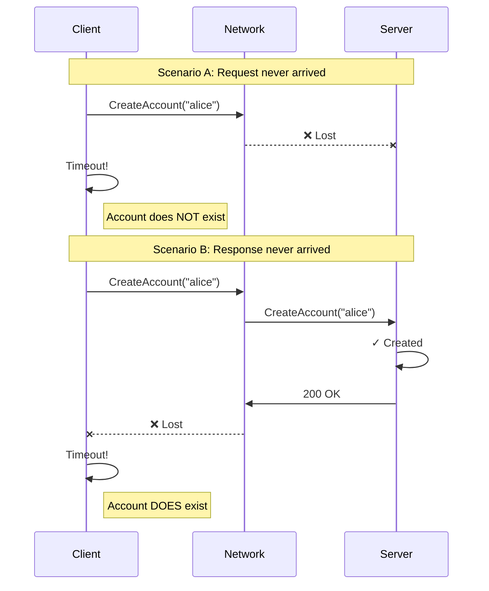

# Indefinite Failures

> **TL;DR**: In distributed systems, some operations have ambiguous outcomes — you don't know if they succeeded or failed. Use `Expect.OneOf()` to model multiple valid possibilities, and let state profiles track the branching outcomes.

---

## The Problem: You Don't Always Know What Happened

When you make a network call, three things can happen:

1. **Success** — The request reaches the server, is processed, and you get the response.
2. **Definite failure** — The request reaches the server, fails validation (bad input, resource not found), and you get an error response.
3. **Indefinite failure** — Something goes wrong — a network timeout, an internal server error, a connection reset — and you don't know whether the server processed your request or not.

That third case is the tricky one. Consider a socket timeout. Two completely different things could have happened:

- **Scenario A**: Your request never reached the server. It got lost in transit. The server never saw it, never processed it, never created the account. The account doesn't exist.

- **Scenario B**: Your request reached the server and was processed successfully. The account was created. But the response got lost on the way back to you. The account *does* exist — you just don't know it.

From the client's perspective, both scenarios look identical: a timeout. But the system state is completely different. In one case the account exists; in the other it doesn't. You genuinely cannot know which until you check.



---

## A Simple Spec Without Failures

Let's start with a basic `CreateAccount` operation that only handles normal cases:

```csharp
spec.Operation<string, ApiResult<decimal>>("CreateAccount", (accountId, state) =>
{
    if (state.Accounts.ContainsKey(accountId))
    {
        return Expect.That<ApiResult<decimal>>(r => r.IsConflict)
               .SameState();
    }

    return Expect.That<ApiResult<decimal>>(r => r.IsSuccess && r.Data == 0)
           .ThenState<BankState>(next => next.Accounts[accountId] = 0);
});
```

This spec assumes every call either succeeds or returns a conflict. But what happens when the network fails?

---

## Modeling Ambiguity with Expect.OneOf

When a socket timeout occurs, we have genuine uncertainty: the operation might have succeeded (response lost) or failed (request lost). Both outcomes are valid from the spec's perspective.

Accordant handles this with `Expect.OneOf()`:

```csharp
spec.Operation<string, ApiResult<decimal>>("CreateAccount", (accountId, state) =>
{
    if (state.Accounts.ContainsKey(accountId))
    {
        return Expect.That<ApiResult<decimal>>(r => r.IsConflict)
               .SameState();
    }

    return Expect.OneOf(
        // Normal success
        Expect.That<ApiResult<decimal>>(r => r.IsSuccess && r.Data == 0)
              .ThenState<BankState>(next => next.Accounts[accountId] = 0),
              
        // Timeout - request never reached server
        Expect.That<ApiResult<decimal>>(r => r.IsTimeout)
              .SameState(),
              
        // Timeout - server processed it, but response was lost
        Expect.That<ApiResult<decimal>>(r => r.IsTimeout)
              .ThenState<BankState>(next => next.Accounts[accountId] = 0)
    );
});
```

If the actual response matches *any* of these outcomes, the spec considers it valid. Notice that when a timeout occurs, *two* `Expect` clauses match the same response — one where state stays unchanged, one where the account was created. Both are valid interpretations. The state profile will track both possibilities until a later observation disambiguates.

The same pattern applies to other transient errors like 500 Internal Server Error. Any response where you can't be certain whether the server-side effect occurred should be modeled with multiple possible outcomes.

> **Tip**: If many operations need this pattern, you can write a helper that wraps any operation's normal outcomes with additional timeout/error branches. This avoids duplicating the pattern everywhere.

---

## How State Profiles Track Branching Outcomes

When `Expect.OneOf()` produces multiple possible next states, Accordant tracks all of them in a **state profile**. Think of it as a set of worlds that are all consistent with what you've observed so far.

After a timeout on `CreateAccount("alice")`, the state profile contains two states:
- One where `alice` doesn't exist (request lost)
- One where `alice` exists with balance 0 (response lost)

When you later call `GetAccount("alice")` and get a 200 OK with balance 0, that response is only valid in one of those states. The profile collapses — you now know the account exists. The other possibility is eliminated.

If instead you get a 404 Not Found, that tells you the account was never created. Again, the profile collapses to the consistent state.

This is exactly how conformance testing works with non-determinism: observe actual responses, eliminate inconsistent possibilities, and continue.

---

## Response-Dependent State Under Uncertainty

Things get more interesting when the server generates values you need to track — like IDs, timestamps, or ETags.

Consider a `CreateJob` operation where the server assigns a job ID:

```csharp
spec.Operation<string, ApiResult<Job>>("CreateJob", (jobName, state) =>
{
    return Expect.OneOf(
        // Success - server created the job and assigned an ID
        Expect.That<ApiResult<Job>>(r => r.IsSuccess && !string.IsNullOrEmpty(r.Data.JobId))
              .ThenState(
                  (ApiResult<Job> response) =>
                  {
                      var next = (AppState)state.Clone();
                      next.Jobs[response.Data.JobId] = new JobState 
                      { 
                          Name = jobName, 
                          Status = JobStatus.Pending 
                      };
                      return next;
                  },
                  mock: () => new ApiResult<Job> 
                  { 
                      Data = new Job { JobId = Guid.NewGuid().ToString(), Name = jobName },
                      StatusCode = 200 
                  }),
              
        // Timeout - we don't know if job was created
        Expect.That<ApiResult<Job>>(r => r.IsTimeout)
              .SameState(),
              
        // Timeout - job was created, but we never saw the ID
        Expect.That<ApiResult<Job>>(r => r.IsTimeout)
              .ThenState<AppState>(next => 
              {
                  // Problem: we don't know the job ID!
                  // We need to model that a job exists but is "unknown" to us
                  next.HasUnknownJob = true;
              })
    );
});
```

The third case is tricky: a job exists on the server, but we never observed its ID. We have to model this gracefully. The state captures the fact that *something* exists that we don't have a handle to.

Subsequent operations need to account for this. A `ListJobs` call might return a job you don't recognize — that's valid if `HasUnknownJob` is true in your state. The unknown becomes known.

---

## When Does This Matter?

If you're testing a system under normal conditions — no network failures, no injected faults — indefinite failures are rare. The happy path dominates.

But if you're:
- **Intentionally injecting faults** to stress-test your system
- **Testing retry logic** and need to verify it handles ambiguous failures correctly
- **Building systems that must be robust** to partial failures (like distributed databases or payment systems)

...then modeling indefinite failures becomes essential. Your spec needs to express the real uncertainty your system faces.

---

## Testing with Fault Injection

To exercise these ambiguous failure paths, you need to inject faults. The key idea: introduce failures at the boundary between your system and external dependencies.

Common approaches:
- **Wrap your HTTP client** in an interface that can randomly throw exceptions
- **Use a proxy** that drops or delays requests
- **Configure your test environment** to simulate network partitions

The specific mechanism depends on your architecture. What matters is that you *can* trigger timeouts and transient errors during testing.

Once you have fault injection in place, an important insight emerges: **not every failure response indicates a bug**. A timeout is only problematic if, when you perform subsequent operations, the system's behavior can't be explained by *any* possible state.

For example: you get a timeout on `CreateAccount("alice")`. Later you call `GetAccount("alice")` and get 404. That's fine — consistent with the "request lost" branch. But if you then call `Deposit("alice", 100)` and it succeeds with a new balance of 100... that's a bug. The 404 told you the account doesn't exist, but the deposit succeeded as if it does. No linearization of events can explain that.

This is the power of state profiles: they track what's *possible*, and conformance testing catches responses that aren't possible given what you've already observed.

---

## See Also

- [Step Functions & Async](step-functions-and-async.md)
- [How-To: Test with Fault Injection](../how-to/fault-injection-testing.md)
- **Sample**: [TodoList-FaultInjection](../../Samples/TodoList-FaultInjection/) — A complete working example demonstrating:
  - Server-side fault injection (pre/post save DB faults)
  - Client-side fault injection (network failures)
  - Generic base class pattern for automatic indefinite failure handling
  - Server-generated timestamps that become unknown on failure
  - Full field validation to catch silent corruption bugs
