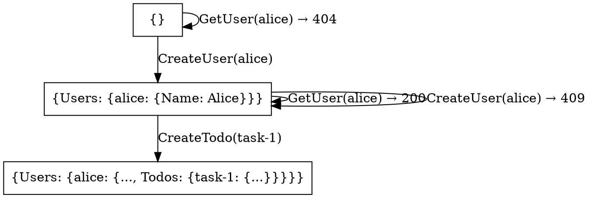

# Tutorial 4: Visualizing State Space

How do you know what Accordant is actually testing? In this tutorial, you'll learn to **visualize the state graph**—seeing every state and transition your tests cover.

**Time:** 10-15 minutes

**What you'll learn:**
- Generating GraphViz visualizations
- Understanding the state graph
- Using visualization for debugging

**Prerequisites:**
- Completed [Tutorial 1](01-your-first-spec.md)
- [GraphViz](https://graphviz.org/download/) installed (optional, for rendering)

---

## What is the State Graph?

Accordant explores your system as a **state graph**:
- **Nodes** = States your system can be in
- **Edges** = Operations that transition between states

From your `InputSet`, Accordant builds this graph and generates test cases that cover the paths.

---

## Generating a Visualization

Add this to your test class:

```csharp
[Test]
public void VisualizeStateSpace()
{
    var spec = CreateSpec();

    // Same inputs as your tests
    var createUser = spec.GetOperation<User, ApiResult<User>>("CreateUser");
    var getUser = spec.GetOperation<string, ApiResult<User>>("GetUser");
    var createTodo = spec.GetOperation<Todo, ApiResult<Todo>>("CreateTodo");

    var inputs = new InputSet()
    {
        createUser.With(new User("alice", "Alice"), "Create Alice"),
        getUser.With("alice", "Get Alice"),
        createTodo.With(new Todo("alice", "task-1", "Buy milk"), "Create todo"),
    };

    // Generate the DOT file content
    var dotContent = TestCaseGenerator.VisualizeStateSpace(
        new TestingContext(spec),
        new AppState(),  // Initial state
        inputs,
        new TestGenerationOptions { MaxDepth = 3 });

    // Write to file
    File.WriteAllText("state-graph.dot", dotContent);
    TestContext.WriteLine("Generated state-graph.dot");
    TestContext.WriteLine(dotContent);
}
```

---

## Rendering the Graph

The output is in [DOT format](https://graphviz.org/doc/info/lang.html). Render it with GraphViz:

```bash
dot -Tpng state-graph.dot -o state-graph.png
```

Or use online tools like [GraphViz Online](https://dreampuf.github.io/GraphvizOnline/).

---

## Understanding the Output

Here's what a simple state graph looks like:



**Reading the graph:**
- `S0` = Initial empty state
- `S1` = State with user "alice" 
- Edges show which operations transition between states
- Self-loops (S1 → S1) are operations that don't change state (GET, or errors)

---

## Visual Example

```
    ┌─────────────────┐
    │     Empty       │ ◄── Initial state (S0)
    │   { Users: {} } │
    └────────┬────────┘
             │ CreateUser("alice")
             ▼
    ┌─────────────────────────┐
    │    User Exists          │ ◄── S1
    │ { Users: {alice: ...} } │
    └────────┬────────────────┘
             │         ▲
             │         │ GetUser("alice") → 200 OK
             │         │ CreateUser("alice") → 409 Conflict
             │         └─────────────────────┘
             │ CreateTodo("task-1")
             ▼
    ┌─────────────────────────────────┐
    │      Todo Exists                │ ◄── S2
    │ { Users: {alice: {Todos: ...}}} │
    └─────────────────────────────────┘
```

---

## Why Visualize?

### 1. Debug Unexpected Coverage

If tests are failing or you're not getting expected coverage:

```csharp
var options = new TestGenerationOptions
{
    MaxDepth = 5,
    StateConstraint = state => ((AppState)state).Users.Count <= 2
};
```

Visualize to see if your `StateConstraint` is cutting off important states.

### 2. Understand Complexity

A small `InputSet` can explode into many states. Visualization helps you understand:
- How many unique states exist
- Which operations cause branching
- Where cycles occur (operations that loop back)

### 3. Validate the Spec

Before running tests, check that the state graph matches your mental model:
- Are error transitions shown?
- Does state change when expected?
- Are there missing transitions?

---

## Customizing the Visualization

You can customize how nodes are labeled:

```csharp
var dotContent = TestCaseGenerator.VisualizeStateSpace(
    new TestingContext(spec),
    new AppState(),
    inputs,
    new TestGenerationOptions { MaxDepth = 3 },
    new VisualizationOptions
    {
        // Custom label: show just user count
        NodeLabelLambda = node =>
        {
            var state = (AppState)node.State;
            return $"Users: {state.Users.Count}\\nTodos: {state.Users.Values.Sum(u => u.Todos.Count)}";
        }
    });
```

---

## Constraining the Graph

Large state spaces are hard to visualize. Use constraints:

```csharp
var options = new TestGenerationOptions
{
    // Limit sequence length
    MaxDepth = 4,
    
    // Limit state complexity
    StateConstraint = state =>
    {
        var s = (AppState)state;
        return s.Users.Count <= 2 && 
               s.Users.Values.All(u => u.Todos.Count <= 2);
    }
};
```

---

## Summary

Visualization helps you understand and debug:

| Use Case | What You Learn |
|----------|---------------|
| View state graph | All states and transitions being tested |
| Debug coverage | Why certain states aren't reached |
| Validate spec | Does the graph match expectations? |
| Communicate | Share understanding with team |

### Key Command

```csharp
var dot = TestCaseGenerator.VisualizeStateSpace(context, initialState, inputs, options);
File.WriteAllText("graph.dot", dot);
// Then: dot -Tpng graph.dot -o graph.png
```

---

## What's Next?

- **[Tutorial 5: Testing Race Conditions](05-testing-race-conditions.md)** - Find concurrency bugs with concurrent tests
- **[Concept: How Test Generation Works](../concepts/how-test-generation-works.md)** - Deep dive into state exploration

---

## Tips

1. **Start small** - Visualize with 2-3 inputs first
2. **Use StateConstraint** - Keep graphs manageable
3. **Custom labels** - Show only relevant state info
4. **SVG format** - Better for large graphs: `dot -Tsvg graph.dot -o graph.svg`
